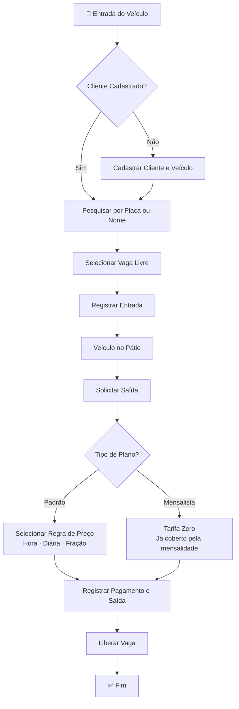

# 🦁 Lion Park — Sistema de Gestão de Estacionamento Premium

> Plataforma robusta para controle operacional e financeiro de estacionamentos, com gestão de pátio em tempo real, controle de mensalidades, faturamento flexível e administração de frotas de clientes.

---

## 🚀 Tecnologias Utilizadas

### Backend
| Tecnologia | Descrição |
|---|---|
| **.NET 10** | Framework principal |
| **C#** | Linguagem de programação |
| **Entity Framework Core** | ORM para persistência de dados |
| **PostgreSQL 16** | Banco de dados relacional |
| **Argon2** | Criptografia avançada para senhas |
| **Clean Architecture** | Domain · Application · Infrastructure · API |

### Frontend
| Tecnologia | Descrição |
|---|---|
| **Angular 21** | Framework para interface do usuário |
| **UnoCSS** | Engine de CSS atômico para alta performance visual |
| **TypeScript** | Superset JavaScript para tipagem estática |
| **Signals** | Gerenciamento de estado reativo moderno |

---

## 🛠️ Configuração do Ambiente

### Pré-requisitos

- [.NET 10 SDK](https://dotnet.microsoft.com/)
- [Node.js 22+](https://nodejs.org/)
- [Docker](https://www.docker.com/)

### 1. Banco de Dados (Docker)

O projeto utiliza Docker para provisionar uma instância do PostgreSQL 16. Na raiz do projeto, execute:

```bash
docker-compose up -d
```

### 2. Inicialização do Banco (SQL)

Conecte-se ao banco `lionpark_db` e execute o script abaixo para criar a estrutura necessária:

```sql
CREATE TABLE users (
    id UUID PRIMARY KEY DEFAULT gen_random_uuid(),
    full_name VARCHAR(255) NOT NULL,
    cpf VARCHAR(20) UNIQUE NOT NULL,
    email VARCHAR(255) UNIQUE NOT NULL,
    password_hash TEXT NOT NULL,
    role VARCHAR(50) NOT NULL,
    plan_type VARCHAR(50) NOT NULL DEFAULT 'Padrão',
    payment_day INT NOT NULL DEFAULT 10,
    is_active BOOLEAN NOT NULL DEFAULT TRUE,
    created_at TIMESTAMP WITH TIME ZONE DEFAULT CURRENT_TIMESTAMP,
    updated_at TIMESTAMP WITH TIME ZONE DEFAULT CURRENT_TIMESTAMP
);

CREATE TABLE vehicles (
    id UUID PRIMARY KEY DEFAULT gen_random_uuid(),
    license_plate VARCHAR(20) UNIQUE NOT NULL,
    model VARCHAR(100) NOT NULL,
    color VARCHAR(50) NOT NULL,
    category VARCHAR(50) NOT NULL,
    user_id UUID NOT NULL,
    created_at TIMESTAMP WITH TIME ZONE DEFAULT CURRENT_TIMESTAMP,
    updated_at TIMESTAMP WITH TIME ZONE DEFAULT CURRENT_TIMESTAMP,
    CONSTRAINT fk_vehicles_users FOREIGN KEY (user_id) REFERENCES users (id) ON DELETE CASCADE
);

CREATE TABLE parking_spots (
    id UUID PRIMARY KEY DEFAULT gen_random_uuid(),
    identification VARCHAR(50) UNIQUE NOT NULL,
    is_occupied BOOLEAN NOT NULL DEFAULT FALSE,
    category VARCHAR(50) NOT NULL,
    created_at TIMESTAMP WITH TIME ZONE DEFAULT CURRENT_TIMESTAMP,
    updated_at TIMESTAMP WITH TIME ZONE DEFAULT CURRENT_TIMESTAMP
);

CREATE TABLE parking_records (
    id UUID PRIMARY KEY DEFAULT gen_random_uuid(),
    entry_time TIMESTAMP WITH TIME ZONE NOT NULL DEFAULT CURRENT_TIMESTAMP,
    exit_time TIMESTAMP WITH TIME ZONE,
    total_amount DECIMAL(10, 2),
    vehicle_id UUID NOT NULL,
    parking_spot_id UUID NOT NULL,
    created_at TIMESTAMP WITH TIME ZONE DEFAULT CURRENT_TIMESTAMP,
    updated_at TIMESTAMP WITH TIME ZONE DEFAULT CURRENT_TIMESTAMP,
    CONSTRAINT fk_records_vehicles FOREIGN KEY (vehicle_id) REFERENCES vehicles (id),
    CONSTRAINT fk_records_spots FOREIGN KEY (parking_spot_id) REFERENCES parking_spots (id)
);

CREATE TABLE price_rules (
    id UUID PRIMARY KEY DEFAULT gen_random_uuid(),
    name VARCHAR(100) NOT NULL,
    type VARCHAR(50) NOT NULL,
    price DECIMAL(10, 2) NOT NULL,
    created_at TIMESTAMP WITH TIME ZONE DEFAULT CURRENT_TIMESTAMP,
    updated_at TIMESTAMP WITH TIME ZONE DEFAULT CURRENT_TIMESTAMP
);

CREATE TABLE subscription_payments (
    id UUID PRIMARY KEY DEFAULT gen_random_uuid(),
    user_id UUID NOT NULL,
    reference_month INT NOT NULL,
    reference_year INT NOT NULL,
    amount DECIMAL(10, 2) NOT NULL,
    payment_date TIMESTAMP WITH TIME ZONE NOT NULL DEFAULT CURRENT_TIMESTAMP,
    CONSTRAINT fk_subscription_users FOREIGN KEY (user_id) REFERENCES users (id) ON DELETE CASCADE
);
```

### 3. Rodando o Backend

```bash
cd backend/LionPark.Api
dotnet run
```

### 4. Rodando o Frontend

```bash
cd frontend
npm install
npm start
```

---

## 🔄 Fluxo da Aplicação

### Ciclo de Vida Operacional de um Veículo



---

## 📋 Funcionalidades

### 🔐 Administração *(restrito ao Admin)*

- **Gestão de Usuários** — Cadastro de funcionários (Operadores). O primeiro usuário criado no sistema é automaticamente promovido a `Admin`.
- **Tabela de Preços** — Definição das regras de cobrança: Fração, Hora, Diária e Mensal.
- **Relatórios Financeiros** — Visão detalhada por período, consolidando todos os recebimentos de saídas avulsas.
- **Configuração de Vagas** — Cadastro e identificação das vagas (ex: `A-01`, `B-05`).

### 🏁 Operacional *(acesso ao Operador)*

- **Clientes e Veículos** — Cadastro de proprietários e seus veículos (carros/motos), com definição de plano: **Padrão** ou **Mensalista**.
- **Controle de Cancelas:**
  - **Entrada** — Busca reativa por placa ou nome. O sistema vincula automaticamente o veículo a uma vaga disponível.
  - **Saída** — O operador seleciona a regra de preço aplicável, com flexibilidade para convênios ou descontos manuais.
- **Mensalidades** — Consulta de status de clientes mensalistas. O sistema sinaliza automaticamente como **Atrasado** quando o dia atual ultrapassa o `payment_day` configurado sem pagamento registrado para o mês corrente.

---

## 📂 Estrutura do Projeto

```
LionPark/
├── backend/
│   ├── LionPark.Domain/          # Entidades de negócio e interfaces de repositórios
│   ├── LionPark.Application/     # DTOs, Serviços e lógica de negócio
│   ├── LionPark.Infrastructure/  # Repositórios, DbContext (EF Core) e segurança
│   └── LionPark.Api/             # Controllers e configuração de DI
└── frontend/                     # Aplicação Angular com Guards e Interceptors
```

---

## 🔑 Perfis de Acesso

| Perfil | Permissões |
|---|---|
| **Admin** | Acesso total: usuários, preços, relatórios e vagas |
| **Operador** | Entrada/saída de veículos, clientes e mensalidades |

> O primeiro usuário cadastrado no sistema é promovido automaticamente a **Admin**.

##status

Em desenvolvimento.

| `main` | versão de trabalho |
| `entrega1409` | versão submetida à avaliação de 14/09/2026 |
| `entrega2809` | versão submetida à avaliação de 28/09/2026 |

---

© 2026 Lion Park Technologies. Todos os direitos reservados.
